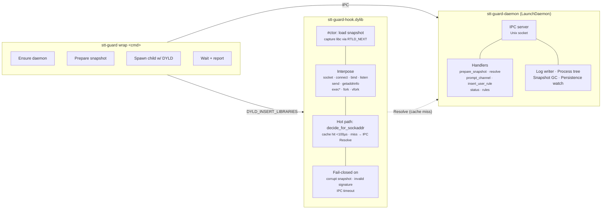

# Contributing to Stentorian Guard

Thanks for your interest in contributing to Stentorian Guard. This guide covers
everything you need to clone, build, test, and submit changes.

## Prerequisites

- **macOS 14 (Sonoma) or later** — Intel or Apple Silicon for macOS install and
  E2E validation
- **Rust toolchain** — stable channel, 1.96+ (install via [rustup](https://rustup.rs/))
- **Bun** — used by repository automation scripts such as the compatibility tracker
- **Docker + Colima** — used by local hooks for Linux lint and E2E parity from
  macOS
- **Git**

```sh
brew bundle       # optional: installs actionlint, Docker/Colima, Bun, and helpers
colima start      # required before Docker-backed local checks
rustc --version   # 1.95 or later
bun --version
docker info
```

## Build

```sh
git clone https://github.com/stentorian-io/guard.git
cd stt-guard
cargo build --workspace --release
```

Build output lands in `target/release/`. The installable artifacts are:

| Binary | Purpose |
|--------|---------|
| `stt-guard` | CLI |
| `stt-guard-daemon` | Background daemon |
| `stt-guard-watchdog` | Daemon liveness monitor |
| `libguard_hook.dylib` | Cargo-built DYLD-injected interposition library. Release packaging and the system installer install it as `stt-guard-hook.dylib`. |

## Development install

Consumer installs should use the repo-hosted installer; see the
[README](README.md#installation). For source-build development, either add
`target/release/` to your `$PATH` or copy the CLI somewhere convenient:

```sh
cp target/release/stt-guard /usr/local/bin/
```

The repo-hosted installer deploys the daemon, watchdog, and hook to the
root-owned system install under `/usr/local/libexec/stt-guard/`. `wrap` and
`status` refuse to run until that hardened install is present and healthy.

Verify the install:

```sh
stt-guard status
```

A healthy install shows daemon state, counters, tracked roots, gaps, and risk
exposure.

## Test

```sh
# Full workspace tests
cargo test --workspace --release

# E2E validation suite only
cargo test -p guard-e2e --release

# Single crate unit tests (faster iteration)
cargo test -p guard-core
cargo test -p guard-daemon
```

Local validation is stage-based. During iteration, run the focused Cargo command
that exercises your change. Before review, let the installed hooks run:
`pre-commit` covers formatting, clippy, shell syntax/lint/tests, Linux
check/lint parity in Docker, macOS and Linux release builds, unit tests, and
integration tests;
`pre-push` covers Linux LD_PRELOAD E2E in Docker and the Tart-backed macOS E2E
suite. The Linux stages use the same `rust:1.96.0-bookworm` container image
locally and in CI, with Cargo caches under `/private/tmp/stt-guard-docker`.

Secret scan and dependency CVE audit are available locally but opt-in because
they can be network-heavy:

```sh
STT_GUARD_PRE_COMMIT_SECRET_SCAN=1 STT_GUARD_PRE_COMMIT_CVE_AUDIT=1 git commit
STT_GUARD_PRE_PUSH_SECRET_SCAN=1 STT_GUARD_PRE_PUSH_CVE_AUDIT=1 git push
```

GitHub Actions remains the required PR validation surface, including secret
scan, dependency audit, and privileged macOS install-health validation.

Benchmark infrastructure lives in `crates/guard-bench/benches/` (criterion) and
`crates/guard-e2e/tests/bench_hot_path_e2e.rs` (live-wrap). Run
`./scripts/bench/hot-path.ts` to reproduce locally. Pre-push runs the
deterministic cache-hit benchmark after the E2E checks on macOS. CI runs the
same cache-hit benchmark, fails if p99 exceeds the 100 microsecond hot-path
budget defined as `CACHE_HIT_BUDGET_NS` near the top of
`scripts/bench/hot-path.ts`, and stores trend data through the workflow cache.
Relative regressions also fail CI unless the PR is explicitly labelled
`accepted-hot-path-regression`; the hard budget still applies. To accept a new
hard budget, update that script constant in the same PR and explain the change.

## Architecture



### How it works

1. CLI sends `PrepareSnapshot` IPC — daemon merges curated + user rules into a CBOR snapshot with a trusted signature manifest
2. CLI spawns the user's command with `DYLD_INSERT_LIBRARIES=stt-guard-hook.dylib`
3. Hook's `#[ctor]` loads the snapshot, captures original libc symbols via `RTLD_NEXT`
4. On `connect()` / `sendto()` / etc.: in-process cache lookup -> `evaluate_policy()` (tier walk)
5. Cache miss -> `Resolve` IPC to daemon for DNS -> cache result -> re-evaluate
6. Deny + TTY -> interactive prompt -> user decision persisted to SQLite

### Rule tiers (precedence order)

1. **CuratedAllow** — built-in trusted network rules: package registries, CDNs (`crates/guard-core/data/trusted-registry-*.yaml`)
2. **UserAllow** — user-created rules (via prompt or `--learn`), persisted in SQLite
3. **CuratedDeny** — malicious/suspicious network IOCs from OSV/GHSA feeds (`crates/guard-core/data/{malicious,suspicious}-*.yaml`)
4. **Default Deny** — everything else

### Security model

Stentorian Guard is a defense-in-depth layer, not a sandbox. Known boundaries:

| Scenario | Coverage | Detail |
|---|---|---|
| Standard networking (libc) | **Blocked** | All `connect()` / `sendto()` / `getaddrinfo()` calls intercepted |
| Hardened-runtime binaries | **Mitigated** | System tools reject DYLD injection; Stentorian Guard blocks `exec` into hardened children from wrapped subtrees |
| Raw syscalls | Not covered | Bypasses libc interposition entirely; not a realistic supply-chain vector — packages use libc. [Tracking issue](https://github.com/stentorian-io/guard/issues/1) |
| Sandbox escape | Not covered | A sufficiently motivated attacker with arbitrary code execution can escape; Stentorian Guard targets the realistic attack class |

## Workspace crates

| Crate | Type | Purpose |
|---|---|---|
| `guard-cli` | bin | CLI entry point — `stt-guard wrap <cmd>`, `stt-guard status` |
| `guard-daemon` | bin | `stt-guard-daemon serve` — IPC server, policy engine, log writer |
| `guard-hook` | cdylib | `stt-guard-hook.dylib` — DYLD-injected interposition library |
| `guard-core` | lib | Domain types, policy evaluator, snapshot codec, lockfile parser |
| `guard-ipc` | lib | CBOR wire protocol, Unix socket transport, peer audit-token auth |
| `stt-guard-watchdog` | bin | Daemon liveness monitor — ping/SIGTERM/SIGKILL escalation |
| `guard-e2e` | tests | E2E test suites and benchmark harness binaries |

## Technology stack

| Layer | Implementation | Notes |
|---|---|---|
| Language | Rust (edition 2024, MSRV 1.85) | All crates |
| Build | Cargo workspaces | Release: LTO thin, codegen-units=1, panic=abort, strip symbols |
| Enforcement | `DYLD_INSERT_LIBRARIES` | Interposes libc network/exec/fork calls via `dlsym(RTLD_NEXT, ...)` |
| IPC | Unix domain socket + CBOR frames | Peer auth via kernel audit token (`LOCAL_PEERTOKEN`) |
| Daemon | Sync 32-thread worker pool | Bounded queue (64); managed by LaunchDaemon |
| Persistence | rusqlite (bundled SQLite) | Migrations in `crates/guard-daemon/migrations/` |
| Serialization | ciborium (CBOR), serde | Snapshot format and IPC wire protocol |
| Logging | tracing + tracing-subscriber | JSONL forensic log to `/var/log/stt-guard/` |
| Integrity | Hardware-backed policy signatures | Snapshot/rule authenticity; hook binary self-check |
| Process tracking | audit_token + pidversion | Fork/exec events; PID-reuse guard |

## IPC protocol

- **Schema versions:** V1 (RegisterRoot), V2 (PrepareSnapshot/Prompt), V3 (Resolve/Status), V4 (ForkEvent/ExecEvent/DylibLoaded)
- **Frame format:** `[1-byte tag][4-byte length BE][CBOR payload]`
- **Auth:** kernel-sourced audit token via `LOCAL_PEERTOKEN` socket option, code-sign verification, and daemon-side message policy

## Conventions

### Commits

[Conventional commits](https://www.conventionalcommits.org/) scoped by subsystem:

```
feat(hook): add sendto interposition
fix(daemon): handle EOF on prompt channel
test(e2e): add workers.dev edge-case test
docs(bench): capture p99 on M1 reference run
chore: update ciborium to 0.2.2
```

Subjects start with lowercase text after the colon and do not end with a period.
Use `ci: ...` without a scope.

### Error handling

- **Hook:** fail-closed — any error in snapshot load, signature verification, or IPC timeout denies all network
- **Daemon:** auto-restarts on crash via watchdog
- **CLI:** structured error types via `thiserror`

### Testing

- Unit tests in each crate (`#[cfg(test)]` modules)
- Integration tests in `crates/*/tests/`
- E2E tests in `crates/guard-e2e/tests/` — spawn real daemon + hook, exercise full flow
- Benchmarks: criterion micro-benchmarks + E2E live-wrap bench (`./scripts/bench/hot-path.ts`)

### Code style

- `cargo fmt` before committing
- `cargo clippy --workspace` should be clean
- `panic=abort` workspace-wide — do not rely on `catch_unwind`

### Automation language policy

- Prefer Rust for product behavior, security-sensitive logic, OS integration,
  policy handling, IPC, persistence, and anything that ships in the Guard
  runtime.
- Use Bun TypeScript for internal repository automation: CI helpers, release
  packaging, feed updates, local hooks, benchmarks, and developer convenience
  scripts.
- Use shell only where the shell runtime is part of the compatibility contract:
  public-facing bootstrap scripts such as `install.sh` and `uninstall.sh`, or
  fixture reconstruction scripts that intentionally depend on shell tooling such
  as `fixtures/vendor-ua-parser-js.sh`.
- Keep public shell scripts POSIX `sh` unless there is an explicit compatibility
  reason not to. Keep fixture shell scripts honest about their interpreter, for
  example Bash when they use Bash-only behavior.

## CI

GitHub Actions run one validation workflow. Secret scan runs first for PRs, then
PR title validation, preparation, and repository linting run before heavier
validation starts:

- `Lint` runs GitHub Actions workflow lint, Markdown lint, Bun script tests,
  public shell lint/tests, and Rust lint in one Ubuntu job.
- Linux check, macOS check, workspace unit tests, and workspace integration
  tests run in parallel after linting passes.
- Linux and macOS release builds run as a release-build matrix after platform
  checks and upload short-lived artifacts.
- Linux E2E runs after the Linux release build plus unit and integration tests;
  macOS E2E runs after the macOS release build plus unit and integration tests.
- Dependency CVE audit runs last for lockfile-changing PRs. The dedicated
  `.github/workflows/cve-audit.yml` workflow runs the scheduled main-branch CVE
  audit, and the README badge represents that nightly main-branch health signal.
  Both audit paths stay Linux-only, install pinned `cargo-audit` with
  `taiki-e/install-action`, disable fallback installs, and need only
  `contents: read` because plain failing jobs and logs are enough.
- If audit install time becomes material, replace the installer step with a
  pinned internal GHCR image that has `cargo-audit` preinstalled and is rebuilt
  nightly for RustSec DB freshness plus tool and base-image updates. Add
  `cargo-deny` only when license, duplicate, or banned-dependency policy exists.
- Platform E2E jobs download the release build artifacts so install-health tests
  exercise the same payload produced by the release-build matrix.
- `.github/workflows/compatibility-tracker.yml` runs Mondays at 08:00 UTC and
  opens review issues when upstream OS, CPU architecture, or toolchain sources
  contain entries missing from `compatibility-matrix.yaml`.
- `.github/workflows/compatibility-nightly.yml` runs daily at 06:00 UTC and
  exercises a scheduled macOS/Rust matrix plus a Linux compile placeholder.

PRs must pass the full CI suite before merging.

For local macOS E2E without mutating the host, use the Tart-backed VM runner:

```sh
brew install cirruslabs/cli/tart hudochenkov/sshpass/sshpass
scripts/ci/macos-vm-e2e.ts
```

The script clones `ghcr.io/cirruslabs/macos-tahoe-base:latest` into
`stt-guard-macos-base` on first use, creates a disposable per-run clone, enables
passwordless sudo inside that clone, copies the repo into the guest, and runs
the macOS E2E suite including `hardened_install_health` with
the production signer path before rebuilding test-signer binaries for the
remaining harness tests. The runner opens the VM UI by default and launches the
guest suite through the user's GUI security session so macOS Keychain enrollment
can create the production signing key. It fails the run if
`hardened_install_health` reports an internal `SKIP:` because the local no-skip
target must prove privileged install health rather than accept a missing test
capability. Set `STT_GUARD_MACOS_VM_GRAPHICS=0` only for headless
test-signer-only debugging. Override the base image or credentials with
`STT_GUARD_MACOS_VM_BASE`, `STT_GUARD_MACOS_VM_BASE_NAME`,
`STT_GUARD_MACOS_VM_USER`, and `STT_GUARD_MACOS_VM_PASSWORD`.

## Troubleshooting

### SIP strips DYLD_INSERT_LIBRARIES

macOS System Integrity Protection (SIP) strips `DYLD_INSERT_LIBRARIES` from
hardened-runtime binaries. This means system binaries like `/bin/bash`,
`/usr/bin/python3`, and `/usr/bin/curl` cannot be hooked.

Stentorian Guard handles this by blocking `exec` calls to hardened-runtime children
from within wrapped process trees. Package managers (Node, Python, Cargo) use
their own non-hardened binaries for network operations, so enforcement still
covers the realistic attack surface.

**Do not disable SIP.** Stentorian Guard is designed to work with SIP enabled.

### Hardened-runtime binaries

If you see messages about skipped hardened-runtime binaries, this is expected.
Stentorian Guard intercepts the parent process's network calls and blocks exec into
hardened children. The protection model:

- `npm` / `node` — hooked (not hardened-runtime)
- `pip` / `python3` — hooked when using a non-system Python (e.g., pyenv, Homebrew)
- `cargo` — hooked (not hardened-runtime)
- `/usr/bin/curl` — not hooked (hardened-runtime, but exec is blocked from wrapped subtrees)

### Environment variables

| Variable | Purpose | Default |
|----------|---------|---------|
| `RUST_LOG` | Logging verbosity | `warn` (CLI), `info` (daemon) |

## Submitting changes

1. Fork the repo and create a branch from `main`
2. Make your changes with conventional commit messages
3. Ensure `cargo test --workspace --release` passes locally
4. Open a pull request against `main`

For larger changes, open an issue first to discuss the approach.
