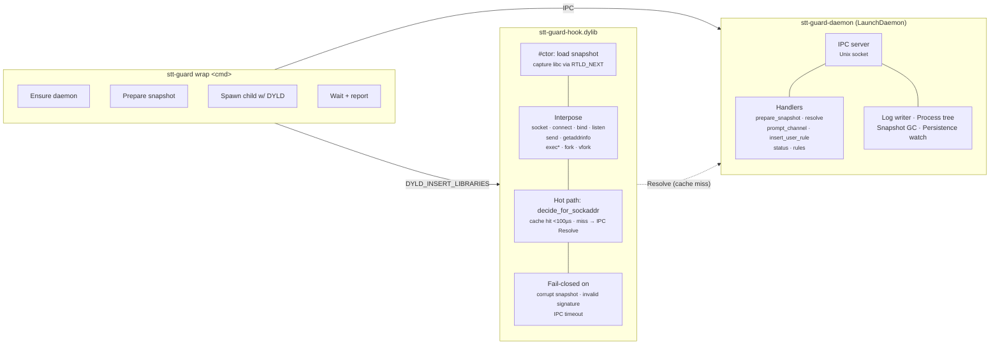

# Contributing to Stentorian Guard

Thanks for your interest in contributing to Stentorian Guard. This guide covers
everything you need to clone, build, test, and submit changes.

## Prerequisites

- **macOS 14 (Sonoma) or later** — Intel or Apple Silicon for macOS install and
  E2E validation
- **Rust toolchain** — stable channel, 1.95+ (install via [rustup](https://rustup.rs/))
- **Node.js 20+** — used by E2E test harnesses (a non-hardened-runtime build; the one from [nodejs.org](https://nodejs.org/) or nvm works)
- **Docker + Colima** — used by local hooks for Linux lint and E2E parity from
  macOS
- **Git**

```sh
brew bundle       # installs actionlint, Docker/Colima, Node, and helpers
colima start      # required before Docker-backed local checks
rustc --version   # 1.95 or later
node --version    # 20 or later
docker info
```

## Build

```sh
git clone https://github.com/stentorian-io/guard.git
cd stt-guard
cargo build --workspace --release
```

Build output lands in `target/release/`. The installable artifacts are:

| Binary | Purpose |
|--------|---------|
| `stt-guard` | CLI |
| `stt-guard-daemon` | Background daemon |
| `stt-guard-watchdog` | Daemon liveness monitor |
| `libguard_hook.dylib` | Cargo-built DYLD-injected interposition library. Release packaging and `stt-guard init` install it as `stt-guard-hook.dylib`. |

## Development install

Consumer installs should use Homebrew and then run `sudo stt-guard init`; see
the [README](README.md#installation). For source-build development, either add
`target/release/` to your `$PATH` or copy the CLI somewhere convenient:

```sh
cp target/release/stt-guard /usr/local/bin/
```

`sudo stt-guard init` deploys the daemon, watchdog, and hook to the root-owned
system install under `/usr/local/libexec/stt-guard/`. `wrap` and `status` refuse
to run until that hardened install is present and healthy.

Verify the install:

```sh
stt-guard status
```

A healthy install shows daemon state, counters, tracked roots, gaps, and risk
exposure.

## Test

```sh
# Full workspace tests
cargo test --workspace --release

# E2E validation suite only
cargo test -p guard-e2e --release

# Single crate unit tests (faster iteration)
cargo test -p guard-core
cargo test -p guard-daemon
```

Local validation is stage-based. During iteration, run the focused Cargo command
that exercises your change. Before review, let the installed hooks run:
`pre-commit` covers formatting, clippy, Linux lint parity in Docker, release
build, unit tests, and integration tests; `pre-push` covers Linux LD_PRELOAD E2E
in Docker and the macOS E2E smoke suite. The Linux stages use the same
`rust:1.95.0-bookworm` container image locally and in CI, with Cargo caches
under `/private/tmp/stt-guard-docker`.

GitHub Actions remains the required PR validation surface, including secret
scan, dependency audit, and privileged macOS install-health validation.

Benchmark infrastructure lives in `crates/guard-hook/benches/` (criterion) and `crates/guard-e2e/tests/bench_hot_path_e2e.rs` (live-wrap). Run `./scripts/bench-hot-path.sh` to reproduce locally.

## Architecture



### How it works

1. CLI sends `PrepareSnapshot` IPC — daemon merges curated + user rules into a CBOR snapshot with a trusted signature manifest
2. CLI spawns the user's command with `DYLD_INSERT_LIBRARIES=stt-guard-hook.dylib`
3. Hook's `#[ctor]` loads the snapshot, captures original libc symbols via `RTLD_NEXT`
4. On `connect()` / `sendto()` / etc.: in-process cache lookup -> `evaluate_policy()` (tier walk)
5. Cache miss -> `Resolve` IPC to daemon for DNS -> cache result -> re-evaluate
6. Deny + TTY -> interactive prompt -> user decision persisted to SQLite

### Rule tiers (precedence order)

1. **CuratedAllow** — built-in trusted network rules: package registries, CDNs (`crates/guard-core/data/trusted-registry-*.yaml`)
2. **UserAllow** — user-created rules (via prompt or `--learn`), persisted in SQLite
3. **CuratedDeny** — malicious/suspicious network IOCs from OSV/GHSA feeds (`crates/guard-core/data/{malicious,suspicious}-*.yaml`)
4. **Default Deny** — everything else

### Security model

Stentorian Guard is a defense-in-depth layer, not a sandbox. Known boundaries:

| Scenario | Coverage | Detail |
|---|---|---|
| Standard networking (libc) | **Blocked** | All `connect()` / `sendto()` / `getaddrinfo()` calls intercepted |
| Hardened-runtime binaries | **Mitigated** | System tools reject DYLD injection; Stentorian Guard blocks `exec` into hardened children from wrapped subtrees |
| Raw syscalls | Not covered | Bypasses libc interposition entirely; not a realistic supply-chain vector — packages use libc. [Tracking issue](https://github.com/stentorian-io/guard/issues/1) |
| Sandbox escape | Not covered | A sufficiently motivated attacker with arbitrary code execution can escape; Stentorian Guard targets the realistic attack class |

## Workspace crates

| Crate | Type | Purpose |
|---|---|---|
| `guard-cli` | bin | CLI entry point — `stt-guard wrap <cmd>`, `stt-guard status` |
| `guard-daemon` | bin | `stt-guard-daemon serve` — IPC server, policy engine, log writer |
| `guard-hook` | cdylib | `stt-guard-hook.dylib` — DYLD-injected interposition library |
| `guard-core` | lib | Domain types, policy evaluator, snapshot codec, lockfile parser |
| `guard-ipc` | lib | CBOR wire protocol, Unix socket transport, peer audit-token auth |
| `stt-guard-watchdog` | bin | Daemon liveness monitor — ping/SIGTERM/SIGKILL escalation |
| `guard-e2e` | tests | E2E test suites and benchmark harness binaries |

## Technology stack

| Layer | Implementation | Notes |
|---|---|---|
| Language | Rust (edition 2024, MSRV 1.85) | All crates |
| Build | Cargo workspaces | Release: LTO thin, codegen-units=1, panic=abort, strip symbols |
| Enforcement | `DYLD_INSERT_LIBRARIES` | Interposes libc network/exec/fork calls via `dlsym(RTLD_NEXT, ...)` |
| IPC | Unix domain socket + CBOR frames | Peer auth via kernel audit token (`LOCAL_PEERTOKEN`) |
| Daemon | Sync 32-thread worker pool | Bounded queue (64); managed by LaunchDaemon |
| Persistence | rusqlite (bundled SQLite) | Migrations in `crates/guard-daemon/migrations/` |
| Serialization | ciborium (CBOR), serde | Snapshot format and IPC wire protocol |
| Logging | tracing + tracing-subscriber | JSONL forensic log to `/var/log/stt-guard/` |
| Integrity | Hardware-backed policy signatures | Snapshot/rule authenticity; hook binary self-check |
| Process tracking | audit_token + pidversion | Fork/exec events; PID-reuse guard |

## IPC protocol

- **Schema versions:** V1 (RegisterRoot), V2 (PrepareSnapshot/Prompt), V3 (Resolve/Status), V4 (ForkEvent/ExecEvent/DylibLoaded)
- **Frame format:** `[1-byte tag][4-byte length BE][CBOR payload]`
- **Auth:** kernel-sourced audit token via `LOCAL_PEERTOKEN` socket option, code-sign verification, and daemon-side message policy

## Conventions

### Commits

[Conventional commits](https://www.conventionalcommits.org/) scoped by subsystem:

```
feat(hook): add sendto interposition
fix(daemon): handle EOF on prompt channel
test(e2e): add workers.dev edge-case test
docs(bench): capture p99 on M1 reference run
chore: update ciborium to 0.2.2
```

### Error handling

- **Hook:** fail-closed — any error in snapshot load, signature verification, or IPC timeout denies all network
- **Daemon:** auto-restarts on crash via watchdog
- **CLI:** structured error types via `thiserror`

### Testing

- Unit tests in each crate (`#[cfg(test)]` modules)
- Integration tests in `crates/*/tests/`
- E2E tests in `crates/guard-e2e/tests/` — spawn real daemon + hook, exercise full flow
- Benchmarks: criterion micro-benchmarks + E2E live-wrap bench (`./scripts/bench-hot-path.sh`)

### Code style

- `cargo fmt` before committing
- `cargo clippy --workspace` should be clean
- `panic=abort` workspace-wide — do not rely on `catch_unwind`

## CI

GitHub Actions run one validation workflow with cheap PR-shape checks first,
then heavier code validation only when relevant files changed:

- PR title, markdown, repo-tooling lint, secret scan, and dependency audit run
  on Ubuntu.
- Rust lint and the Linux compile gate run on Ubuntu before paid macOS work.
- Build, unit tests, integration tests, and macOS E2E run on macOS.
- Linux E2E runs on Ubuntu after integration tests, in parallel with macOS E2E.
- The macOS release build uploads binaries as a short-lived artifact; the macOS
  E2E job downloads those exact binaries so install-health tests exercise the
  same payload produced by the build job.

PRs must pass the full CI suite before merging.

## Troubleshooting

### SIP strips DYLD_INSERT_LIBRARIES

macOS System Integrity Protection (SIP) strips `DYLD_INSERT_LIBRARIES` from
hardened-runtime binaries. This means system binaries like `/bin/bash`,
`/usr/bin/python3`, and `/usr/bin/curl` cannot be hooked.

Stentorian Guard handles this by blocking `exec` calls to hardened-runtime children
from within wrapped process trees. Package managers (Node, Python, Cargo) use
their own non-hardened binaries for network operations, so enforcement still
covers the realistic attack surface.

**Do not disable SIP.** Stentorian Guard is designed to work with SIP enabled.

### Hardened-runtime binaries

If you see messages about skipped hardened-runtime binaries, this is expected.
Stentorian Guard intercepts the parent process's network calls and blocks exec into
hardened children. The protection model:

- `npm` / `node` — hooked (not hardened-runtime)
- `pip` / `python3` — hooked when using a non-system Python (e.g., pyenv, Homebrew)
- `cargo` — hooked (not hardened-runtime)
- `/usr/bin/curl` — not hooked (hardened-runtime, but exec is blocked from wrapped subtrees)

### Environment variables

| Variable | Purpose | Default |
|----------|---------|---------|
| `RUST_LOG` | Logging verbosity | `warn` (CLI), `info` (daemon) |

## Submitting changes

1. Fork the repo and create a branch from `main`
2. Make your changes with conventional commit messages
3. Ensure `cargo test --workspace --release` passes locally
4. Open a pull request against `main`

For larger changes, open an issue first to discuss the approach.
