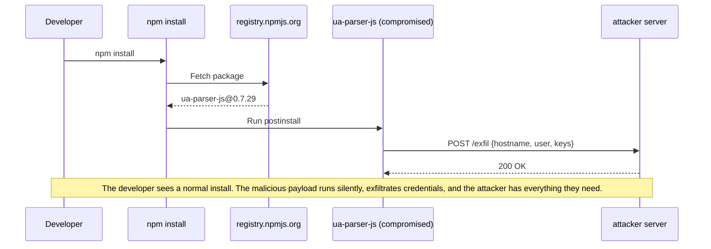
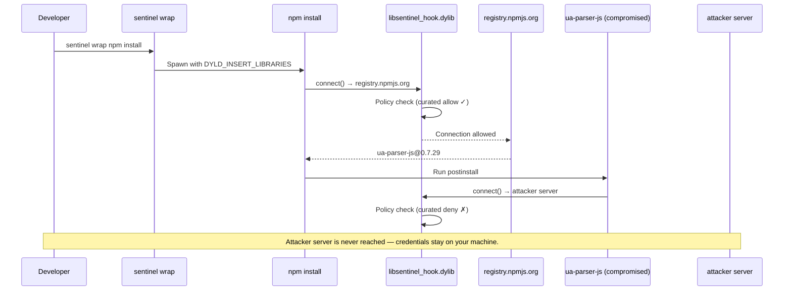

<p align="center">
  <!-- TODO: Replace with actual logo image -->
  <h1 align="center">Sentinel</h1>
  <p align="center">
    <strong>Installing dependencies shouldn't feel like Russian Roulette</strong>
  </p>
  <p align="center">
    <a href="#license"></a>
  </p>
</p>

---

<!-- TODO: Replace with animated terminal GIF showing Sentinel in action -->
<!-- <p align="center"></p> -->

## Table of contents

- [Why Sentinel?](#why-sentinel)
  - [How exfiltration usually happens](#how-exfiltration-usually-happens)
  - [How Sentinel prevents it](#how-sentinel-prevents-it)
- [Usage](#usage)
  - [Installation](#installation)
  - [Manual](#manual)
  - [Aliased](#aliased)
  - [Shell (recommended)](#shell-recommended)
  - [Reviewing activity](#reviewing-activity)
  - [Manuals](#manuals)
- [Coverage](#coverage)
  - [Platform support](#platform-support)
  - [Threat intelligence](#threat-intelligence)
  - [Security limitations](#security-limitations)
- [Found Sentinel useful?](#found-sentinel-useful)
- [Changelog](#changelog)
- [Contributing](#contributing)
- [Licensing](#licensing)

## Why Sentinel?

Compromised dependencies are silently stealing developer credentials at an unprecedented scale — and every project is a target. Sentinel is a free, community-driven solution that cuts off exfiltration to C2 servers.

### How exfiltration usually happens

Every process you run in your terminal can make outbound network connections
without asking. Package installs execute code from hundreds of strangers.
Developer tools phone home with telemetry. Build scripts reach out to analytics
endpoints. Most of the time you have no visibility into what's leaving your
machine.

Consider a real-world scenario: a compromised npm package like `ua-parser-js`
(October 2021). An attacker publishes a hijacked version containing a
postinstall script. Here's what happens when you install it:



These attacks are accelerating. AI-driven development means more dependencies
pulled in faster, with less review — and a single compromised package propagates
like a worm through thousands of downstream projects. What happened to
[event-stream](https://blog.npmjs.org/post/180565383195/details-about-the-event-stream-incident),
[ua-parser-js](https://github.com/nicedreams/ua-parser-js-hijack-incident),
and [colors/faker](https://www.theverge.com/2022/1/9/22874949/developer-corrupts-open-source-libraries-colors-faker-protest)
is now happening across every ecosystem.

### How Sentinel prevents it

Same scenario, but the developer runs `sentinel wrap npm install`. Sentinel
injects a hook library into the process tree that intercepts every outbound
connection before it leaves the machine:



Policy is evaluated in tier order:

1. **Curated Allow** — registries, CDNs
2. **Confirmed Deny** — threat-intel IOCs (confirmed malicious)
3. **User Deny** — your deny rules
4. **User Allow** — your allow rules
5. **Suspect Deny** — suspected IOCs (prompts if TTY)
6. **Default Deny**

Cache hits resolve in under 100 microseconds with no IPC.

- No root privileges required
- No kernel extensions or system extensions
- No manual setup — the daemon auto-starts on first use
- Works with any command or binary run from the terminal, not just package managers

## Usage

### Installation

```sh
brew install stentorian-io/tap/sentinel
```

Or build from source — see [CONTRIBUTING.md](CONTRIBUTING.md#build) for
prerequisites and detailed instructions.

### Manual

> For trying out and setting baselines only. Use
> [shell](#shell-recommended) for day-to-day work.

Wrap individual commands on a case-by-case basis:

```sh
sentinel wrap npm install
sentinel wrap pip install -r requirements.txt
sentinel wrap cargo build
sentinel wrap ./some-script.sh
```

Build a baseline of expected network destinations for a known-clean project
with learn mode:

```sh
sentinel wrap --learn npm install
```

This auto-allows all destinations encountered during the run and records them
as user rules. Only use this on a project you trust. Requires a TTY.

### Aliased

Alias specific toolchain commands so they always go through Sentinel:

```sh
# In ~/.zshrc or ~/.bashrc
alias npm="sentinel wrap npm"
alias pip="sentinel wrap pip"
alias cargo="sentinel wrap cargo"
```

A reasonable middle ground — your package managers are always protected, but
anything you haven't aliased runs unmonitored and malicious code that clears the
shell environment can still reach the network. Run the unwrapped command directly
(e.g. `command npm install`) to bypass the alias for a specific invocation.

### Shell (recommended)

Wrap your entire shell session so every command is protected by default:

```sh
# In ~/.zshrc or ~/.bashrc — must be first
sentinel wrap --shell
```

This must appear before other commands in your shell configuration — anything
that runs before this line (e.g. other plugin initialisation, `eval` calls)
bypasses enforcement. The most intrusive option but also the most secure:
nothing leaves your machine without going through Sentinel's policy.

### Reviewing activity

Check daemon health and hook integrity:

```sh
sentinel status
```

Review denied connections from a specific run (the run UUID is printed when
`sentinel wrap` completes):

```sh
sentinel status denials <run-id>
```

Interactively walk through recent denials and create allow/deny rules:

```sh
sentinel status review              # review most recent run
sentinel status review <run-id>     # review a specific run
```

List active policy rules:

```sh
sentinel status rules                    # user rules only
sentinel status rules --include-built-in # include registry allowlists
```

View persistence-write events (files written during a wrapped run):

```sh
sentinel status persistence              # all events
sentinel status persistence <run-id>
```

Look up threat-intel advisory details:

```sh
sentinel status advisory <advisory-id>   # e.g. MAL-2025-3008
```

Stream the JSONL forensic log:

```sh
sentinel status logs
```

### Manuals

Running `sentinel` with no arguments prints help with all available commands
and options:

```sh
sentinel
```

```
Usage: sentinel <COMMAND>

Commands:
  wrap     Wrap a command with default-deny network policy
  status   Show daemon health, hook integrity, and run history
  install  Install the background daemon as a LaunchAgent
  help     Print this message or the help of the given subcommand(s)

Options:
  -h, --help     Print help
  -V, --version  Print version
```

Detailed documentation is also available via man pages:

```sh
man sentinel    # CLI usage
man sentineld   # daemon internals
```

## Coverage

### Platform support

| Platform | Version       | Status        | Mechanism                | Notes                                                                                                                                                                                                                                                     |
| -------- | ------------- | ------------- | ------------------------ | --------------------------------------------------------------------------------------------------------------------------------------------------------------------------------------------------------------------------------------------------------- |
| macOS    | 13+ (Ventura) | **Supported** | DYLD injection           | Primary platform, tested in CI                                                                                                                                                                                                                            |
| macOS    | 12 (Monterey) | Best-effort   | DYLD injection           | Not tested in CI                                                                                                                                                                                                                                          |
| Linux    | —             | Planned (v2)  | LD_PRELOAD / seccomp-bpf | [Tracking issue](https://github.com/stentorian-io/sentinel/issues/2)                                                                                                                                                                                      |
| Windows  | —             | Not planned   | —                        | Windows restricts userspace library injection behind kernel-mode driver signing and security features that require paid enterprise certificates. There is no equivalent to DYLD or LD_PRELOAD available to open-source tools without elevated privileges. |

### Threat intelligence

Sentinel ships with threat intelligence sourced from
[OSV.dev malicious-package advisories](https://osv.dev) (the OSSF Malicious
Packages dataset). A nightly CI job pulls new advisories, commits them to the
repository, and the data is baked into the binary at compile time — no runtime
network fetches, no phone-home. Hand-curated abuse-pattern rules (e.g. shared
hosting domains commonly used for exfiltration) supplement the automated feed.

| Signal                      | Action                                       | Source                           |
| --------------------------- | -------------------------------------------- | -------------------------------- |
| Confirmed malicious package | **Default deny**                             | OSV.dev advisories               |
| Suspected malicious host    | **Flagged** — surfaces an interactive prompt | Hand-curated abuse patterns      |
| Known-good registry/CDN     | **Allow**                                    | Curated allowlists per ecosystem |

### Security limitations

No security tool provides absolute protection, and any tool claiming 100%
coverage is either misleading you or naive about how attackers operate.
Sentinel is defense-in-depth, not a sandbox: it raises the cost of an attack
rather than eliminating it. Policy is enforced in userspace, so an attacker who
can run arbitrary native code, issue raw syscalls, or exploit the kernel can
bypass it — as they can bypass any userspace defense. Advanced techniques like
return-oriented programming (ROP) can chain existing code gadgets to invoke
syscalls without ever calling the hooked libc functions. At the extreme, even
hardware has proven vulnerable (Rowhammer, Spectre).

Sentinel's allowlists are domain-based, which means a compromise of a
previously trusted domain or subdomain (e.g. a hijacked CDN endpoint or a
compromised registry mirror) would pass policy checks. Sentinel cannot
distinguish legitimate traffic from malicious traffic on an allowed host.

What Sentinel handles well is the realistic, high-volume attack class:
supply-chain packages that phone home through standard networking calls, which
is how the overwhelming majority of these compromises work. The aim is to lift
the bar high enough to stop those attacks cold — while being honest that a
sufficiently funded and determined attacker can still chain vulnerabilities to
get what they want.

## Found Sentinel useful?

Sentinel is free and always will be — it's a community-driven effort to protect
developers from supply-chain attacks. If it's saved you from a sketchy package
or just gives you peace of mind, consider
[sponsoring the project](https://github.com/sponsors/stentorian-io).

<!-- TODO: Add sponsorship badge when set up -->

## Changelog

See [GitHub Releases](https://github.com/stentorian-io/sentinel/releases) for
release history.

## Contributing

See [CONTRIBUTING.md](CONTRIBUTING.md) for architecture details, crate map, IPC
protocol documentation, and build instructions.

## Licensing

Licensed under either of

- [Apache License, Version 2.0](LICENSE-APACHE)
- [MIT License](LICENSE-MIT)

at your option.

Unless you explicitly state otherwise, any contribution intentionally submitted
for inclusion in this project by you, as defined in the Apache-2.0 license,
shall be dual licensed as above, without any additional terms or conditions.

---

<p align="center">
  Built by <a href="https://stentorian.io">Stentorian</a> — because developers deserve nice things.
</p>
