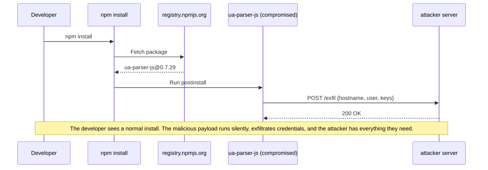

<div align="center">
  
  <h1 align="center">Stentorian Guard</h1>
  <h4 align="center">When a compromised dependency tries to phone home, Guard severs the line.</h4>
  <p align="center">
    <a href="https://github.com/stentorian-io/guard/releases/latest"></a>
    <a href="https://github.com/stentorian-io/guard/actions/workflows/cve-audit.yml"></a>
    <a href="https://github.com/stentorian-io/guard/actions/workflows/feed-update.yml"></a>
    <a href="#license"></a>
  </p>
</div>

---

<!-- TODO: Replace with animated terminal GIF showing Stentorian Guard in action -->
<!-- <p align="center"></p> -->

## Table of contents

- [Why Stentorian Guard?](#why-stentorian-guard)
  - [How exfiltration usually happens](#how-exfiltration-usually-happens)
  - [How Stentorian Guard prevents it](#how-stentorian-guard-prevents-it)
  - [Existing alternatives](#existing-alternatives)
- [Usage](#usage)
  - [Installation](#installation)
  - [Updating](#updating)
  - [Manual](#manual)
  - [Aliased](#aliased)
  - [Shell (recommended)](#shell-recommended)
  - [Reviewing activity](#reviewing-activity)
  - [Environment](#environment)
  - [Manuals](#manuals)
- [Coverage](#coverage)
  - [Compatibility matrix and tracking](#compatibility-matrix-and-tracking)
  - [Threat intelligence](#threat-intelligence)
  - [Security expectations](#security-expectations)
- [Found Stentorian Guard useful?](#found-stentorian-guard-useful)
- [Changelog](#changelog)
- [Contributing](#contributing)
- [Licensing](#licensing)

## Why Stentorian Guard?

Compromised dependencies are silently stealing developer credentials at an unprecedented scale — and every project is a target. Stentorian Guard is a free, community-driven solution that cuts off exfiltration to C2 servers.

### How exfiltration usually happens

Every process you run in your terminal can make outbound network connections
without asking. Package installs execute code from hundreds of strangers.
Developer tools phone home with telemetry. Build scripts reach out to analytics
endpoints. Most of the time you have no visibility into what's leaving your
machine.

Consider a real-world scenario: a compromised npm package like `ua-parser-js`
(October 2021). An attacker publishes a hijacked version containing a
postinstall script. Here's what happens when you install it:



These attacks are accelerating. AI-driven development means more dependencies
pulled in faster, with less review — and a single compromised package propagates
like a worm through thousands of downstream projects. What happened to
[event-stream](https://blog.npmjs.org/post/180565383195/details-about-the-event-stream-incident),
[ua-parser-js](https://github.com/nicedreams/ua-parser-js-hijack-incident),
and [colors/faker](https://www.theverge.com/2022/1/9/22874949/developer-corrupts-open-source-libraries-colors-faker-protest)
is now happening across every ecosystem.

### How Stentorian Guard prevents it

Same scenario, but the developer runs `stt-guard wrap npm install`. Stentorian Guard
injects a hook library into the process tree that intercepts every outbound
connection before it leaves the machine:


Policy is evaluated in tier order:

1. **Curated Allow** — registries, CDNs
2. **Confirmed Deny** — threat-intel IOCs (confirmed malicious)
3. **User Deny** — your deny rules
4. **User Allow** — your allow rules
5. **Suspect Deny** — suspected IOCs (prompts if TTY)
6. **Default Deny**

Cache hits resolve in under 100 microseconds with no IPC; see the
[hot-path benchmark report](docs/hot-path-benchmark.md) for the measured budget,
CI gate, and regression review process.

- No kernel extensions or system extensions
- One-line installer with root-owned hardened deployment
- Works with any command or binary run from the terminal, not just package managers
- Root-owned binaries + `_stt_guard` service user — tamper-resistant

### Existing alternatives

Stentorian Guard applies default-deny outbound network enforcement to any command you
run in your terminal — not just package installs. Supply-chain attacks during
`npm install` are the motivating example, but the same protection covers build
scripts, dev servers, test suites, and anything else you wrap with `stt-guard
wrap`. It's designed to work on your laptop today (macOS), on Linux tomorrow,
and in CI pipelines, giving you a single default-deny layer everywhere. It's not a
replacement for EDRs, application firewalls, audit tools, SCA scanners, or
lockfiles; it's the layer they're missing.

For a detailed comparison with specific tools (CrowdStrike, LuLu, npm audit,
Socket/Snyk, lockfiles, and more), see [docs/alternatives.md](docs/alternatives.md).

## Usage

### Installation

#### Supported install path

```sh
curl -fsSL https://stentorian.io/guard/install.sh | sh
```

The installer downloads the latest GitHub Release artifact for your Mac,
verifies it against the release checksum file, and then runs the hardened system
install with `sudo`. The system install creates a `_stt_guard` service user,
deploys root-owned binaries to `/usr/local/libexec/stt-guard/`, enrolls a
device-local macOS Keychain rule-signing key for the invoking user,
registers that public signer with the daemon state, and starts the daemon as a
LaunchDaemon. This is the only supported consumer deployment mode — it prevents
a compromised process from tampering with the guard itself. See the
[deployment model](SECURITY.md#deployment-model) for details.

All other commands (`wrap`, `status`) require the hardened install to be healthy
and will refuse to run otherwise.

GitHub Releases are used for changelogs, release metadata, auditability, and
installer inputs. Manual binary installation from a release artifact is not a
supported install path: a misplaced binary, hook library, plist, or ownership
bit can silently weaken the deployment model.

### Updating

```sh
stt-guard update
```

The update command downloads the latest GitHub Release artifact, verifies it
against the release checksum file, and reruns the hardened system install from
the downloaded binary. Updates preserve daemon state, user rules, and logs.

Check for an available update without installing it:

```sh
stt-guard update --check
```

Check your installed version:

```sh
stt-guard --version
```

### Uninstalling

```sh
curl -fsSL https://stentorian.io/guard/uninstall.sh | sh
```

The default uninstall removes the LaunchDaemon and root-owned binaries while
preserving daemon state, user rules, and logs. To remove state and logs too:

```sh
curl -fsSL https://stentorian.io/guard/uninstall.sh | sh -s -- --purge
```

### Manual

> For trying out and setting baselines only. Use
> [shell](#shell-recommended) for day-to-day work.

Wrap individual commands on a case-by-case basis:

```sh
stt-guard wrap npm install
stt-guard wrap pip install -r requirements.txt
stt-guard wrap cargo build
stt-guard wrap ./some-script.sh
```

Build a baseline of expected network destinations for a known-clean project
with learn mode:

```sh
stt-guard wrap --learn npm install
```

This auto-allows all destinations encountered during the run and records them
as user rules. Only use this on a project you trust. Requires a TTY.

### Aliased

Alias specific toolchain commands so they always go through Stentorian Guard:

```sh
# In ~/.zshrc or ~/.bashrc
alias npm="stt-guard wrap npm"
alias pip="stt-guard wrap pip"
alias cargo="stt-guard wrap cargo"
```

A reasonable middle ground — your package managers are always protected, but
anything you haven't aliased runs unmonitored and malicious code that clears the
shell environment can still reach the network. Run the unwrapped command directly
(e.g. `command npm install`) to bypass the alias for a specific invocation.

### Shell (recommended)

Wrap your entire shell session so every command is protected by default:

```sh
# In ~/.zshrc or ~/.bashrc — must be first
stt-guard wrap --shell
```

This must appear before other commands in your shell configuration — anything
that runs before this line (e.g. other plugin initialisation, `eval` calls)
bypasses enforcement. The most intrusive option but also the most secure:
nothing leaves your machine without going through Stentorian Guard's policy.

### Reviewing activity

Check daemon health and hook integrity:

```sh
stt-guard status
```

Review denied connections from a specific run (the run UUID is printed when
`stt-guard wrap` completes):

```sh
stt-guard status denials <run-id>
```

Interactively walk through recent denials and create allow/deny rules:

```sh
stt-guard status review              # review most recent run
stt-guard status review <run-id>     # review a specific run
```

List active policy rules:

```sh
stt-guard status rules                    # user rules only
stt-guard status rules --include-built-in # include registry allowlists
```

Disable a built-in allow rule (e.g. when a registry is compromised):

```sh
stt-guard status rules --disable registry.npmjs.org --reason "suspected compromise"
```

Re-enable a previously disabled built-in rule:

```sh
stt-guard status rules --enable registry.npmjs.org
```

View persistence-write events (files written during a wrapped run):

```sh
stt-guard status persistence              # all events
stt-guard status persistence <run-id>
```

Look up threat-intel advisory details:

```sh
stt-guard status advisory <advisory-id>   # e.g. MAL-2025-3008
```

Stream the JSONL forensic log:

```sh
stt-guard status logs
```

### Environment

Stentorian Guard uses these environment variables for advanced configuration
and source-build workflows:

| Variable | Purpose |
| --- | --- |
| `STT_GUARD_STATE_DIR` | Override the state directory used by the CLI, daemon, and hook. In a hardened install, `stt-guard wrap` passes the system state directory through to wrapped processes; source-build workflows default to `~/Library/Application Support/Stentorian Guard` on macOS and `$XDG_STATE_HOME/stt-guard` or `~/.local/state/stt-guard` on Linux. |
| `STT_GUARD_HOOK_DYLIB` | Override the hook library path used by `stt-guard wrap` in development/test mode. Production installs ignore this variable and use the verified root-owned system hook. |
| `RUST_LOG` | Control CLI and daemon logging verbosity. |

`STT_GUARD_SNAPSHOT_MANIFEST` is an internal per-run variable injected by
`stt-guard wrap` into wrapped processes. Development and test harness variables
use the `STT_GUARD_TEST_*` prefix, plus `STT_GUARD_E2E_NODE` for selecting a
Node.js binary in end-to-end tests; they are not part of the stable user
interface.

### Manuals

Running `stt-guard` with no arguments prints help with all available commands
and options:

```sh
stt-guard
```

```
Usage: stt-guard <COMMAND>

Commands:
  update  Download, verify, and install the latest release
  wrap    Wrap a command under default-deny network enforcement
  status  Inspect daemon health, rules, denials
  help    Print this message or the help of the given subcommand(s)

Options:
  -h, --help     Print help
  -V, --version  Print version
```

Detailed documentation is also available via man pages:

```sh
man stt-guard    # CLI usage
man stt-guard-daemon   # daemon internals
```

## Coverage

### Compatibility matrix and tracking

Reviewed OS, CPU architecture, scanner, toolchain, and packaging
coverage is tracked in the compatibility matrix. The README keeps the support
summary short; the comprehensive tables live in
[docs/compatibility.md](docs/compatibility.md), with platform-specific notes in
[macOS support](docs/macos.md), [Linux support](docs/linux.md), and
[Windows support](docs/windows.md).

Scheduled automation keeps that matrix current without expanding trust by
itself. The weekly compatibility tracker opens human-review issues for new OS,
CPU architecture, Rust, LLVM, Xcode, and Linux lifecycle
entries. Nightly threat-intel updates open PRs for new malicious-package IOCs.
New releases, allow rules, deny rules, and support claims are
only accepted after review, and the PR validation workflow verifies that the
checked-in compatibility metadata still matches those claims.

### Threat intelligence

Stentorian Guard ships with threat intelligence sourced from
[OSV.dev malicious-package advisories](https://osv.dev) (the OSSF Malicious
Packages dataset). The nightly IOC feed-update workflow pulls new advisories,
commits them to the repository, and the data is baked into the binary at
compile time — no runtime network fetches, no phone-home. Hand-curated
abuse-pattern rules (e.g. shared hosting domains commonly used for exfiltration)
supplement the automated feed.

| Signal                      | Action                                       | Source                           |
| --------------------------- | -------------------------------------------- | -------------------------------- |
| Confirmed malicious package | **Default deny**                             | OSV.dev advisories               |
| Suspected malicious host    | **Flagged** — surfaces an interactive prompt | Hand-curated abuse patterns      |
| Known-good registry/CDN     | **Allow**                                    | Curated allowlists per ecosystem |

### Security expectations

Stentorian Guard is defense-in-depth, not a sandbox. It stops the realistic,
high-volume attack — supply-chain packages that phone home through standard
networking calls — which is how the overwhelming majority of these compromises
work. The goal is to make that attack class fail by default.

Wrapped processes also fail closed on local relay paths: `localhost`,
`localhost6`, `127.0.0.0/8`, `::1`, and direct Unix-domain socket connects.
Local IPC is not treated as safe when untrusted wrapped code could hand data to
an unwrapped relay process.

With the [standard installation](SECURITY.md#deployment-model), a local attacker needs
root to tamper with the guard's binaries, database, or logs. Without root, the
remaining attack surface is DYLD stripping (a parent process removing the
injection variable before spawning children) and runtime memory patching of the
in-process hook — both require deliberate, targeted effort beyond what
supply-chain malware attempts.

It is not designed to stop a sufficiently determined attacker who can exploit
the kernel or target infrastructure outside the process tree. On macOS,
unsupported Mach-O shapes, unknown native CPU subtypes, malformed scanner
inputs, and native binaries that contain raw syscall instruction bytes fail
closed at exec time. Shebang scripts remain allowed because the interpreter is
the executable runtime that receives the hook. A future design will investigate
non-fail-closed alternatives for that T3 class. The [security policy](SECURITY.md)
documents the full threat model, known platform constraints, and what is (and
isn't) considered a vulnerability. Read it before assuming Stentorian Guard is
a sandbox — it isn't one, and we are upfront about where the boundaries are.

## Found Stentorian Guard useful?

Stentorian Guard is free and always will be — it's a community-driven effort to protect
developers from supply-chain attacks. If it's saved you from a sketchy package
or just gives you peace of mind, consider
[sponsoring the project](https://github.com/sponsors/stentorian-io).

<!-- TODO: Add sponsorship badge when set up -->

## Changelog

See [GitHub Releases](https://github.com/stentorian-io/guard/releases) for
release history.

## Contributing

See [CONTRIBUTING.md](CONTRIBUTING.md) for architecture details, crate map, IPC
protocol documentation, and build instructions.

## Licensing

Licensed under either of

- [Apache License, Version 2.0](LICENSE-APACHE)
- [MIT License](LICENSE-MIT)

at your option.

Unless you explicitly state otherwise, any contribution intentionally submitted
for inclusion in this project by you, as defined in the Apache-2.0 license,
shall be dual licensed as above, without any additional terms or conditions.

---

<p align="center">
  Built by <a href="https://stentorian.io">Stentorian</a> — because developers deserve nice things.
</p>
